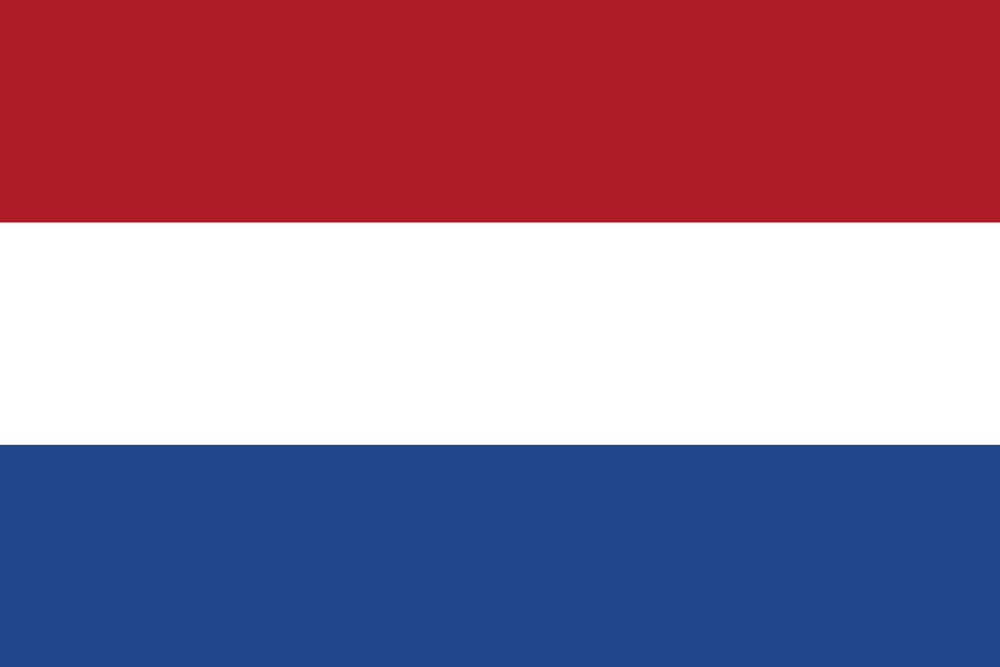

**Gatsby Theme Amsterdam** was designed to be a minimal
and clean theme geared towards photographers, artists and other
creative folks. Inspired by the capital city of the Netherlands known
for its artistic heritage, impressive architecture and canals that
criss-cross the city. Truthfully I have never visited before but it
sounds like a pretty cool place so I decided to use the name.

  <iframe
    title="github"
    src="https://ghbtns.com/github-btn.html?user=ryanwiemer&repo=gatsby-theme-amsterdam&type=star&count=true&size=large"
    frameBorder="0"
    scrolling="0"
    width="160px"
    height="30px"
  ></iframe>

Created by **[Ryan Wiemer](https://twitter.com/ryanwiemer)**

## Features

- Minimal responsive design
- Optional page transitions
- Multiple grid options to display posts
- Customizable theme colors and typography with Theme UI
- MDX support
- SEO friendly component
- Mobile menu
- Optional scroll progress indicator
- Optional toggle to switch color modes
- Emotion using styled-components syntax
- Tags
- Pagination
- Offline support
